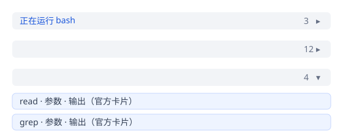

# dsh-fold

Fold **consecutive tool calls inside one assistant turn** in the DeepSeek
Harness (DSH) Web GUI into a single line — Codex-style — with a live
running-tool label, a running call count, and expand/collapse. **Long user
input is folded to 3 lines** with its own 展开/收起 toggle.

Implementation is **pure Slot / React**. No DOM patching, no `MutationObserver`,
no `display:none`, no `querySelector` games — the official product renderers
are reused for every expanded tool card (and the user bubble is rebuilt from
official primitives).



```
正在运行 bash                                        3   ▸     <- one tool running
                                                   12   ▸     <- all settled (left side empty)
                                                   4    ▾     <- expanded
                                                             (official tool cards, in order)
```

## Behaviour

- **Grouping rule**: `tool-call` nodes that are consecutive in the chat flow
  (`snapshot.chat.order`) and belong to the same turn form one group.
  Assistant-step nodes whose blocks contain ONLY reasoning (Think rows) are
  TRANSPARENT: they neither split chains, but fold WITH the group (hidden
  while collapsed, re-shown between the calls when expanded). Model-retry
  notices (已重试模型请求) are transparent the same way — they never split a
  chain into separate bars; the retry row folds in with the work it
  interrupted and counts toward the group's block count. Think rows
  with NO adjacent tools fold into their OWN bar (think-only group). The
  reasoning part of a text-bearing node is folded away too — **only text
  stays visible**. Only real assistant TEXT (and user/steering messages,
  commands, compaction, …) ends a run — verified against a real 288-call session: with the old rule
  every per-step Think row split the chain into 150 groups; with
  transparency the same stream folds into 85 groups split exclusively by
  text. (In the DSH data model every tool-producing step streams a reasoning
  block, so without this rule every call would isolate into its own group.)
- **While a call is running**: the collapsed line shows only the currently
  running tool (`正在运行 <tool>` / `Running <tool>`), the accumulated call
  count (completed + running), and a chevron. When the running call settles,
  the label switches to the next running call, or disappears entirely once
  every call has settled — **including error/cancelled/interrupted calls**
  (any `tool-result` form, `isError` or not).
- **Expanded**: the group bar stays on top (chevron down); below it every
  member renders through the **official `tool.call.toolview` dispatch** — the
  exact same slot path the product's `ToolCallTree` uses — so bash/read/grep/
  web/… cards, status, parameters, output, error, subcalls and nested calls
  all keep their native look. New calls arriving while expanded are appended
  live; the user's expanded state never resets (it lives in React state of
  the group leader seat, keyed by the stable first-call node key).
- **Turn-level big fold**: when a turn (one user message + the agent's whole
  working cycle) CLOSES with a final summary, everything except the summary —
  tool calls, Think rows AND intermediate assistant text — folds behind ONE
  bar reading `该轮次工作过程已折叠` / `Turn work process folded`. The small
  folds live INSIDE the big fold: expanding the big fold reveals them at
  their original positions; the summary text always stays visible. A turn
  that is still open, or that ended without a summary, keeps the current
  (small-fold only) view.
- **Bar label**: the folded bar reports `N 个块已被折叠` / `N blocks folded`
  — N is the number of folded blocks (tool calls + Think rows folded into
  the group; subcalls inside a block are not counted). While a call runs,
  the left side shows `正在运行 <tool>` / `Running <tool>`.
- **Live block in the bar = the conversation's latest state**: the folded
  bar's left side shows what the CURRENT conversation is doing RIGHT NOW —
  the newest active block anywhere in the flow, not a per-group label: a
  streaming Think row renders `[Think] · <latest line>`, a working tool call
  renders its real row (`[icon] Bash · <command description>` for a terminal
  call, `Read · <path>`, `Search · <query>`, `ask_user_question ·
  <question>`, … — the product's `toolRowModel` replicated verbatim). While
  a call executes the working call is the latest; once it settles and the
  model reasons again, the Think row takes over; when the conversation is
  idle the left side is empty. The live block shows ONLY while the group is
  COLLAPSED — expanded, the details are right below, so the bar's left goes
  empty. The bar whose own group hosts the active node additionally shows
  the product's row sweep.
- **Everything non-text folds**: automatic context compression
  (`compaction`), context injection (`context`), manual compaction
  (`manual-compaction`), user commands such as `/permission` (`command`),
  model-retry notices (`model-retry` — 已重试模型请求), turn errors
  (`turn-error`), max-token notices (`turn-max-tokens`), unknown surfaces
  (`unknown`) and workflow runs (`workflow-run`) are folded like any other
  work block — each behind its own `1 个块已被折叠` bar in an open turn
  (expandable, so diagnostics stay reachable), and inside the turn-level
  big fold once the turn closes with a summary. Only plain text (user and
  steering messages, assistant text, summaries and the summary's copy/chrome
  row) stays visible.
- **User input**: a user message whose text overflows 3 lines is clamped to
  3 lines with a `展开` / `Expand` toggle below the bubble (shown only when
  the text really overflows, measured via ResizeObserver). The clamp lives
  on a PADDING-FREE inner box (`max-height: 72px` = exactly 3 × 24px line
  height), so every browser renders exactly 3 lines with the bubble's
  bottom gap intact — browsers whose legacy line-clamp behavior would show
  a partial 4th line flush against the bubble bottom get clipped to 3 lines
  (verified in headless Chromium). The bubble is a faithful replica of the
  product's `UserStyleBubble` built from **official primitives**
  (`MessageText`, ref chips for `/name` `@name` tokens, `JsonBlock` extras,
  the official `ImageGallery`, the product time + copy actions with the
  official `writeClipboard`) — replication, not delegation, because
  Chromium's line-clamp does not clamp content inside a nested flex
  container (the official row is `display:flex`; verified empirically in
  headless Chromium). Short messages render untouched (clamp is a no-op,
  toggle hidden).
- **Auto-load older at the top**: scrolling the conversation to the very
  top while older history exists automatically pulls the next page
  (`loadOlder`) — no button click needed; the product's 加载更早 button
  remains as a manual fallback. While the user KEEPS resting at the top and
  `hasMore` stays true, pages continue loading one after another until the
  history is exhausted or the user scrolls away (each completed load re-arms
  the pump with the refreshed snapshot). The scroll host is resolved through
  the product's own `scrollerOf` contract
  (`[data-conversation-scroll]`), the action is the session scope's official
  `conversation.loadOlder()`, and guards (near-top threshold, `hasMore`,
  `loadingOlder`, in-flight pump) prevent duplicate or mid-scroll loads.
  This is the one behavioral DOM read in the plugin (a passive scroll
  listener); nothing is patched or restyled.

## DSH version

Developed and verified against **DSH `0.1.0-rc.7`** (`dsh --version`).
The runtime overlay is guarded by a method-text check and fails closed
(plugin stays inert) on a different version.

## Architecture / extension seam

```
ChatView (conversation.view)
  └─ ChatNodeSeat × N                       one seat per business node
       └─ renderSlot("conversation.chat.node", {node}, {entryKey: kind})
            ├─ cell "tool-call":
            │      product:  ToolCallTree  (priority 0)
            │      ours:     ToolCallGroupView (priority -100  ← lowest wins)
            │                   ├─ collapsed bar (running label · count · chevron)
            │                   └─ expanded: interleaved items
            │                        ├─ think rows: InlineThink (ReasoningRow replica)
            │                        └─ tool calls: ToolCallBranch × N
            │                             └─ renderSlot("tool.call.toolview", …)
            │                                 ← official per-tool cards (bash, read, …)
            └─ cell "assistant-step":
                   product:  AssistantNodeView (priority 0)
                   ours:     AssistantNodeWrapper (priority -100)
                                ├─ reasoning-only node inside a tool run → null
                                │    (the group owns its Think rows)
                                └─ everything else → delegates to the official
                                     AssistantNodeView from the live registry
            └─ cell "user":
                   product:  UserMessageNodeView (priority 0)
                   ours:     UserNodeWrapper (priority -100)
                                └─ product bubble replica from official
                                     primitives + 3-line clamp + 展开/收起
            └─ cells "compaction" / "context" / "manual-compaction" / "command":
                   product:  CompactionItem / ContextInjectionRow / … (priority 0)
                   ours:     NoticeNodeWrapper (priority -100)
                                └─ one-line folded bar; expands to the official
                                     view (command keeps its commandview slot)
```

1. **Seam**: the keyed Chat slot `conversation.chat.node`, cells `tool-call`,
   `assistant-step`, `user`, `compaction`, `context`, `manual-compaction`
   and `command`, shadowed by priority (the slot core documents "register at
   a different priority to shadow it (lowest renders)"). The group is
   computed in React from the conversation snapshot (`useSession` →
   `snapshot.chat.order` + `snapshot.chat.nodes`), never from the DOM.
2. **Only the group leader renders**: each tool-call node has its own seat;
   the seat of the group's *first* member renders the group row, every other
   member seat returns `null` (zero-height flowItem), so there is exactly one
   row per group.
3. **One framework accommodation**: the slot core forbids a second entry
   from declaring `children` for an already-declared slot, and without that
   children table the shadowing entry receives no `renderSlot` binding for
   `tool.call.toolview`. `src/client/slots-core-overlay.ts` installs a
   **reversible overlay** on `SlotCore.prototype.register` /
   `.releaseEntry` (same module instance the shell uses — ui-slots is a
   shell-own static module) that treats an *identical* child spec as a
   shared co-declaration. The overlay is a THIN WRAPPER around the live
   methods (no method-text dependency), so it works against both the
   published package and the minified shipped web bundle; it restores the
   pristine methods on unload and never disturbs the product's
   declarations. This is the exact change of `docs/core-patch.md` (a
   source-level patch), delivered at runtime so the plugin works on
   unmodified DSH installs. Without this overlay the pure slot API
   **cannot** express "shadow a keyed renderer AND delegate to its child
   slot" — that is the single architecture limitation this plugin papered
   over, with the core change kept strictly separated.

## Install (web profile)

```bash
# from a local checkout (build first):
pnpm install
pnpm build

# option A — official plugin CLI:
dsh plugin --profile web add /absolute/path/to/dsh-fold

# option B — helper script (equivalent):
pnpm run install:dsh          # uses DSH_PROFILE (default: web)

# then restart the web app:
dsh --profile web
```

`dsh plugin … add` sees the package's `dsh.bundle.patch` declaration and
appends `dsh-fold` to the profile bundle stack; the client loader
picks up the `dsh.client.platform: "web"` manifest and serves
`exports["./client"]` to the page. The host row is a minimal anchor only.

For a GitHub install: `dsh plugin --profile web add github:you/dsh-fold`.

## Uninstall

```bash
dsh plugin --profile web remove dsh-fold
# or: pnpm run uninstall:dsh
# restart the web app — the official tool-call UI renders again immediately.
```

There is no residue: the slot entry, the overlay, the locale dictionaries
and the stylesheet are all removed with the plugin (each registration is
owned by the plugin fiber / ctx.effect).

## Build & test

```bash
pnpm install          # esbuild, typescript, @types/react, react, ui-slots (devDeps)
pnpm build            # tsc --noEmit + esbuild bundles (lib/)
pnpm test             # 13 suites: group · tool-row · auto-load · turn-fold · overlay (real ui-slots) · bundle smoke · component · assistant · user · notice · integration
```

## Acceptance mapping

| Case | Result |
| --- | --- |
| 1 single tool running | `正在运行 bash  1 ▸` |
| 2 read✓ grep✓ bash running | `正在运行 bash  3 ▸` |
| 3 all settled | `3 ▸` — left side empty |
| 4 last failed | `2 ▸` — left side empty (error = ended) |
| 5 expand | bar + official cards, in order |
| 6 expand then new call | stays expanded, count grows, member appended |
| 7 assistant text | text untouched; groups never absorb it |
| 8 two chains split by text | two independent bars |
| 9 streaming | live count/running label via snapshot re-render (no polling) |
| 10 uninstall | official ToolCallTree wins the cell again automatically |
| 11 long user input | bubble clamps to exactly 3 lines, `展开` toggle appears |
| 12 expand user input | full text, `收起` toggle, copy/time actions intact |
| 13 short user input | untouched, no toggle |
| 14 user message w/ images/refs | official gallery + `/name` `@name` chips preserved |
| 15 running bash in a group | bar shows the real block row: `Bash · <description/command>` |
| 16 streaming think (no tool yet) | bar shows `Think · <latest line>` |
| 17 all settled | bar left side empty |
| 18 compaction/context/命令 | folded (`1 个块已被折叠`), inside the big fold when closed |
| 19 long user input, legacy clamp | still exactly 3 lines + bottom gap (padding-free clamp box) |
| 20 scroll to top with older history | auto-loads the next page (no click), once per scroll-to-top |
| 21 mid-scroll / no history / loading | no auto-load |

## Known limitations

- The expanded member rendering replicates the product's small `ToolCall`
  wrapper (call-row div + subcall recursion) because that wrapper is not
  exported; the actual cards are the official `tool.call.toolview` entries.
  The generic fallback for tools *without* a registered toolview is a
  compact theme-aware card (name/args/output/error) instead of the internal
  `GenericToolCard`.
- The user bubble is likewise a replica (from official primitives), not a
  delegation: Chromium's `-webkit-line-clamp` cannot clamp through the
  official row's nested flex layout (verified in headless Chromium), so the
  clamp has to live on our own element. The replica keeps the product's
  bubble, ref chips, images, time and copy actions; if a future DSH changes
  the user bubble's visuals, the replica CSS must follow.
- The bar's live content is the product's collapsed-row replica
  (`toolRowModel` + the running Think row) — same titles/summaries as the
  product rows, but re-rendered by the plugin; a future DSH changing the row
  model's titles or summary keys must be mirrored in `tool-row.ts`.
- Diagnostics (model-retry, turn-error, turn-max-tokens, unknown,
  workflow-run) fold too, per the all-non-text rule — each behind an
  expandable `1 个块已被折叠` bar, so failures stay reachable in one click.
- Group identity = first member's stable node key. If older history is
  loaded that prepends a tool call *before* the current leader, leadership
  moves to the new first node and that group's expanded state resets.
- The slot-core overlay relies on two structural invariants of this
  SlotCore version (register pushes the new entry into the parent record;
  releaseEntry tears down `entry.children`); if a future version breaks
  them, the wrapper fails closed (plugin inert, official UI unaffected).
- Expanding long chains re-mounts the official cards; hundreds of settled
  calls stay collapsed by default, so scrolling cost stays ~one row.

## Files

```
src/client/group.ts               pure grouping over the snapshot (unit-tested)
src/client/turn-fold.ts           turn-level big fold over the snapshot (unit-tested)
src/client/tool-row.ts            running-tool row model (product toolRowModel replica)
src/client/auto-load.ts           scroll-to-top auto-load-older (sessions scope)
src/client/AutoLoadHost.tsx       seat ref anchor wiring seats into the auto-loader
src/client/ToolCallGroupView.tsx  group row (live block content) + official members
src/client/AssistantNodeWrapper.tsx assistant-step shadow (official delegation)
src/client/UserNodeWrapper.tsx    user bubble replica + 3-line clamp + toggle
src/client/NoticeNodeWrapper.tsx  compaction/context/manual-compaction/command shadow
src/client/registry.ts            shared live-registry access for delegation
src/client/translate.ts           shared fold translate slot
src/client/slots-core-overlay.ts  reversible SlotCore overlay (docs/core-patch.md)
src/client/styles.ts              theme-variable CSS
src/client/vendor.d.ts            minimal ambient types for the DSH page packages
src/client/index.ts               plugin entry (registration)
src/host/index.ts                 minimal host anchor
cordis.patch.yml                  bundle patch layer (host row)
build.mjs                         tsc + esbuild
scripts/install-dsh.cjs           install/uninstall helper
test/                             group · tool-row · auto-load · turn-fold · overlay · bundle-smoke · render suites
docs/core-patch.md                the one core change, as a source patch
```

## License

MIT
